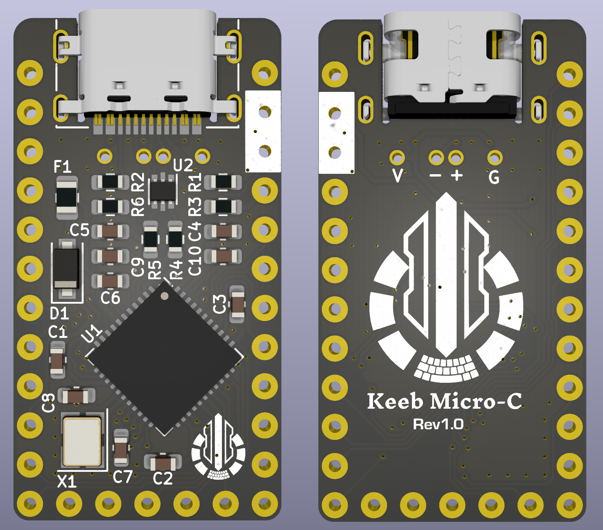

# KeebMicro-C

The KeebMicro-C is a Pro Micro compatible microcontroller board designed for DIY mechanical keyboards in Japan.
It is based on the same Atmel ATMega32U4 chip and can be programmed using Arduino IDE or keyboard-specific firmware such as TMK or QMK.
Conthrough, commonly used in Japan, eliminates the need for soldering.

## Links

- [fork root](https://github.com/staticintlucas/goldfish)

## Changes compared to Goldfish v2

- Conthrough support
- Reduced board outline
- Changed logo
- Added through-hole for external USB connector

## License

Released under the Creative Commons Attribution Share-Alike 4.0 License.
https://creativecommons.org/licenses/by-sa/4.0/
